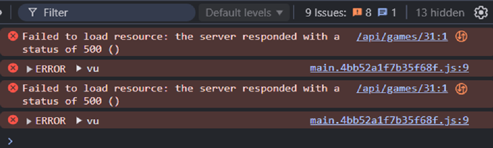
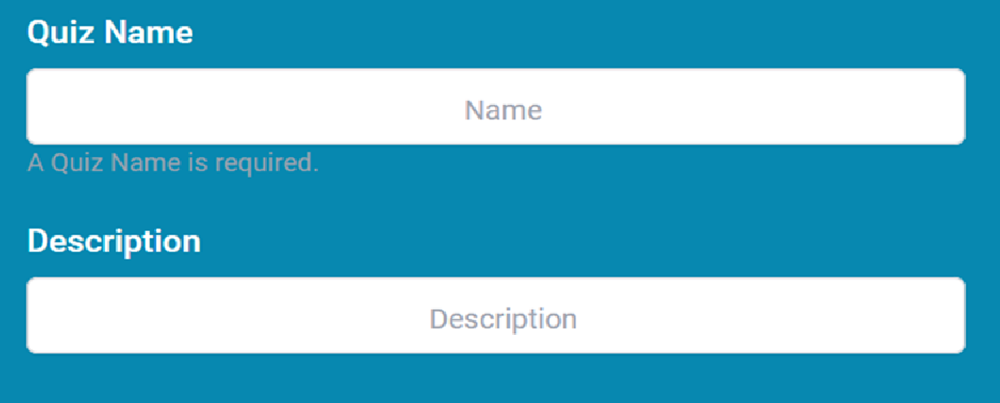
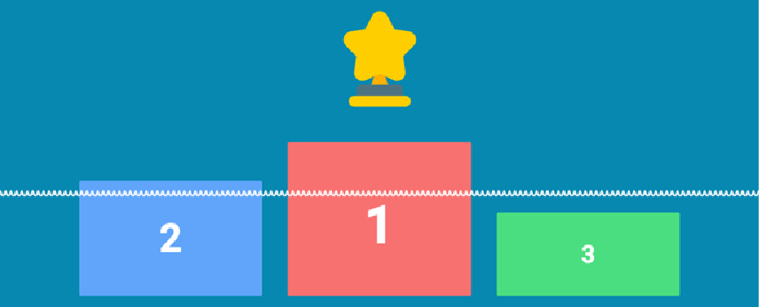
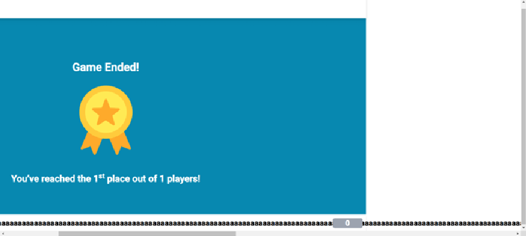

:source-highlighter: highlight.js
:highlightjsdir: hljs
:highlightjs-theme: default
:highlightjs-languages: basic
:source-highlighter: coderay

= Test Documentation for Leohoot

Project: Leohoot

Author: Marceta Mia

Testing Period: Up to December 8, 2024

Note: Some issues documented here may no longer be relevant after the deployment scheduled for December 9, 2024.

== Summary
Leohoot is a website that teachers can use to easily and creatively create quizzes for their lessons. The purpose of this testing phase is to identify bugs in the current version.

== Test Environment
Operating Systems: Windows 11
Browsers Tested: Chrome v131.0.6778.109
Devices Tested: Desktop, Mobile (Galaxy A20e)

== Testing
=== Page Name: Login Page
Tested Features:

* User login with valid credentials
* Error message for invalid credentials

Test Cases:

[cols="1,3,1,1"]
|===
| Test-Nr | Description | Steps | Status
| Login-01 | Login with valid credentials. | 1. Enter a valid Username and Password. 2. Click "Sign In". | [.lime]#Pass#
| Login-02 | Login with invalid credentials. Error message expected. | 1. Enter an invalid Username or Password. 2. Click "Sign In". | [.lime]#Pass#
|===

=== Page Name: Quiz Overview
Tested Features:

* Search bar functionality
* Create a waiting room
* Deleting a Quiz

Test Cases:

[cols="1,3,1,1"]
|===
| Test-Nr | Description | Steps | Status
| Overview-01 | Search. | 1. Put in any text. 2. Click “Enter” or the search button. | [.lime]#Pass#
| Overview-02 | Create a waiting room. | 1. Click “Start” Button on any Quiz. 2. Click “Start” in waiting room. | [.lime]#Pass#
| Overview-03 | Starting a Quiz with 0 questions doesn’t create a waiting room. Error message missing. | 1. Click “Start” Button on a Quiz with 0 questions. 2. Page is a white screen, Error message only in console. | [.yellow]#Minor#
|===

|===
| Overview-04 | Deleting a Quiz. | 1. Click the trashcan Icon on your Quiz. 2. Click “OK” on the pop up. | [.lime]#Pass#
|===

=== Page Name: Maker
Tested Features:
* Creating a Quiz
* Adding Tags
* Adding and saving questions to a quiz

Test Cases:

[cols="1,3,1,1"]
|===
| Test-Nr | Description | Steps | Status
| Maker-01 | Input all necessary credentials to create a Quiz. | 1. Add Name and Description. 2. Save. | [.lime]#Pass#
| Maker-02 | Input only Name. Error message expected. | 1. Add only Name. 2. Save. 3. Pop up appears. | [.lime]#Pass#
| Maker-03 | Input only Description. Error message expected. | 1. Add only Description. 2. Save. 3. Pop up appears. | [.lime]#Pass#
| Maker-04 | Real-time validation message missing for cleared "Description" field. | 1. Enter text in the "Description" field. 2. Delete the text. 3. Observe no message is shown. 4. Compare with "Name" field, which displays "A Quiz Name is required." | [.yellow]#Minor#
|===

|===
| Maker-05 | Add new Tag. | 1. Open “Add Tags” and enter Text in the new text field. 2. Click “+”. | [.lime]#Pass#
| Maker-06 | Unsaved questions are deleted when test-playing a quiz, without warning to save. | 1. Create a new quiz. 2. Add questions but do not click "Save". 3. Click "Play". 4. Unsaved questions are deleted. | [.fuchsia]#Moderate#
| Maker-07 | Questions with 0 right answers possible. | 1. Create a question without ticking any boxes. 2. Save. | [.yellow]#Minor#
|===
image::test-doc-images/image-2025-01-20-00-44-40-586.png[Maker-07]
|===
| Maker-08 | Optional answer spaces disappear after saving and can't be added back to the Question, which may cause confusion. | 1. Add 2 answer options. 2. Leave the other 2 optional spaces empty. 3. Save the question. 4. Go back to the question to try adding another option. | [.yellow]#Minor#
|===
image::test-doc-images/image-2025-01-20-00-45-03-144.png[Maker-08]
|===
| Maker-09 | No save when uploading an image to a question after saving | 1. Create a question. 2. Save. 3. Upload an image. 4. Create a new Question. Image of previous question disappears | [.yellow]#Minor#
|===

=== Page Name: Student Login
Tested Features:
* Joining a game

Test Cases:

[cols="1,3,1,1"]
|===
| Test-Nr | Description | Steps | Status
| Student-01 | Login with valid room code and nickname. | 1. Click “Join Quiz”. 2. Enter valid Quiz code and nickname. | [.lime]#Pass#
| Student-02 | Login with invalid room code. Error message expected. | 1. Click “Join Quiz”. 2. Enter invalid Quiz code. 3. Pop up message with text “This game does not” appears. | [.lime]#Pass#
| Student-03 | Login with valid room code and invalid nickname. | 1. Enter valid code. 2. Enter nickname with less than 3 characters. 3. Message “Nickname must be at least 3 characters long.” | [.lime]#Pass#
| Student-04 | There is no character limit for the nickname if it is too long. | 1. Enter valid code. 2. Enter a long nickname. 3. No error message. | [.yellow]#Minor#/[.fuchsia]#Moderate#
|===

=== Page Name: Demo-Quiz
Tested Features:
* Teacher view of a running Quiz
* Student view and functionality

Test Cases:

[cols="1,3,1,1"]
|===
| Test-Nr | Description | Steps | Status
| DemoT-01 | Playing a quiz without students. | 1. Start a Quiz. 2. Click through the Quiz until Results. | [.lime]#Pass#
| DemoT-02 | Playing a simple quiz with students | 1. Start a Quiz and wait for students to join. 2. Play like normal and wait for results. | [.lime]#Pass#
| DemoS-01 | Both teacher and student using the same device are kicked from the quiz when the student clicks the "Done" button. | 1. Start a quiz in a new tab as a teacher. 2. Join the same quiz in another tab as a student. 3. The student clicks the "Done" button after answering a question. 4. The student receives an error message: "Game was canceled by the teacher". 5. The teacher's tab is redirected back to the quiz overview. | [.yellow]#Minor#
|===

== Results
[cols="2"]
|===
|Total Cases: |21|
Passed Cases: |14|
Minor Issues: |5.5|
Moderate Issues: |1.5
|===

