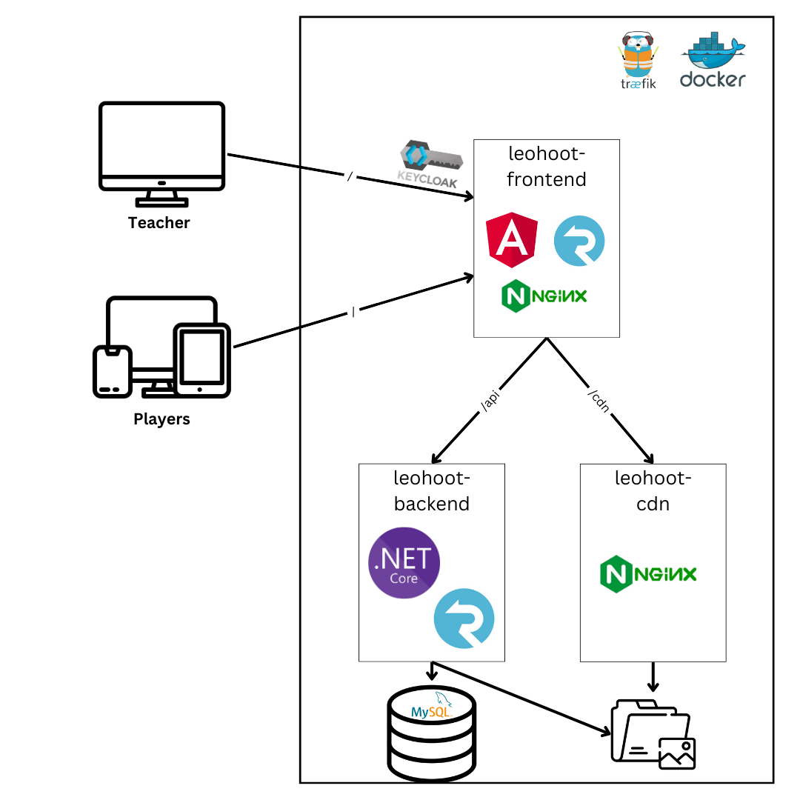

# Inhalt
- [1 Entwicklungsumgebung](#1-entwicklungsumgebung)
    - [1.1 Datenbank und Nginx-Server](#11-datenbank-und-nginx-server)
    - [1.2 Backend](#12-backend)
    - [1.3 Frontend](#13-frontend)
- [2 Projektaufbau](#2-projektaufbau)
    - [2.1 leohoot-frontend](#21-leohoot-frontend)
        - [2.1.1 assets](#211-assets)
        - [2.1.2 components](#212-components)
        - [2.1.3 model](#213-model)
        - [2.1.4 screens](#214-screens)
        - [2.1.5 services](#215-services)
        - [2.1.6 validators](#216-validators)
    - [2.2 leohoot-backend](#22-leohoot-backend)
        - [2.2.1 Base](#221-base)
        - [2.2.2 Core](#222-core)
        - [2.2.3 Persistence](#223-persistence)
        - [2.2.4 ConsoleApp](#224-consoleapp)
        - [2.2.5 Api](#225-api)
- [3 Wichtige Teile](#3-wichtige-teile)
    - [3.1 Game Ablauf](#31-game-ablauf)
    - [3.2 Quiz Maker](#32-quiz-maker)
- [4 Hosting](#4-hosting)
- [5 Backup](#5-backup)

# 1 Entwicklungsumgebung
## 1.1 Datenbank und Nginx-Server
Um Lokal das Projekt starten zu können, muss als erstes die Datenbank und der nginx Server gestartet werden.

Sämtliche Files fürs Hosting und auch fürs lokale Starten liegen im Ordner "composes". Für das Entwickeln muss das lokale compose mit folgendem Command gestartet werden: ```docker compose -f docker-compose-local.yml``` 

Um diesen Command ausführen zu können benötigt man **docker und docker-compose**. Als Endresultat sollten nun zwei Container laufen. Mit ```docker ps``` kann das überprüft werden.

## 1.2 Backend
Das Backend ist ein ASP.net Projekt. Geöffnet kann es entweder mit **Rider, Visual Studio oder Visual Studio Code**. Um die API zu starten gibt es mehrere Möglichkeiten:

1) Navigation in den Ordner der API und ausführen von ```dotnet run``` oder ```dotnet watch``` (Watch übernimmt Echtzeit-Updates vom Code)
2) API als Start Projekt in Rider bzw. Visual Studio auswählen und auf grünen Pfeil drücken

Installiert muss dafür die **.NET SDK 8** sein.
## 1.3 Frontend
Das Frontend kann in **Webstorm oder in Visual Studio Code** geöffnet werden. Bevor das Projekt gestartet werden kann muss mit ```npm i``` alle Packages installiert werden. Auch hier kann in der Console oder mithilfe der IDE gestartet werden:

1) Navigation in den Root Ordner vom Angular Projekt und ```ng serve``` ausführen
2) Im Webstorm mit grünem Pfeil starten

Benötigt wird dafür **Nodejs und Angular**.

Standardmäßig können sich nur Lehrer beim Dashboard anmelden. Für das Testen und Entwickeln muss man sich jedoch auch selbst freischalten. Dafür muss im file "model/auth-guard.ts" beim return die eigene if Nummer hinzugefügt werden.

# 2 Projektaufbau

## 2.1 leohoot-frontend
Das Frontend von Leohoot basiert auf Angular. Es wird kein css verwendet sonder tailwindcss. Das heißt sämtliche Stylings erfolgen direkt im HTML-Code. [https://tailwindcss.com/](https://tailwindcss.com/)
### 2.1.1 assets
Alle Bilder etc. befinden sich in diesem Ordner.
### 2.1.2 components
In diesem Ordner befinden sich alle Einzelteile von den Screens, die entweder aufgrund von Übersichtlichkeit oder Wiederverwendbarkeit ausgelagert werden. Alle Komponenten, die auf mehreren Screens verwendet werden, wie zum Beispiel die Navigationsleiste, befinden sich im Order "general-components". Ansonsten sind die Components immer in dem Ordner mit der Bezeichnung des Screens in dem sie verwendet werden. 
### 2.1.3 model
In Model befinden sich alle Interfaces die verwendet werden.
### 2.1.4 screens
Hier befinden sich alle Screens. Dabei sind sie in student und teacher aufgeteilt:
- **Students**: alle Screens für die Spielerseite. Hier muss sich nicht mit Keycloak angemeldet werden, um darauf zu gelangen. 
- **Teacher**: alle Screens für das starten und erstellen eines Quizzes und das einsehen der Statistiken. Es können sich nur Lehrer anmelden.

**Keycloak**: System das verwendet wird, um zu ermöglichen, dass sich die Lehrer mit ihren Schulaccounts anmelden können.
### 2.1.5 services
- **auth-interceptor.service.ts**: Dieser Service sorgt dafür, dass ein vorhandener Token automatisch bei einem REST-Request angehängt wird.

- **auth.service.ts**: Einige Zeit lang war es noch nicht möglich das sich Lehrer mit Keycloak anmelden konnten. Deswegen gab es einen manuellen Login. Mittlerweile geht alles schon über Keycload, jedoch existiert der auth.service noch als Zwischenschicht zwischen Keycloakservice und den Komponenten, falls der eigene Login wieder benötigt wird.

- **rest.service.ts**: Hier befinden sich alle REST-Zugriffe die im ganzen Projekt benötigt werden. Die Url ändert sich je nachdem, ob man in Production oder im Development ist. Dafür sorgen die Files im Ordner "environment".

- **signalr.service.ts**: Bei einem Spiel erfolgt die Kommunikation zwischen dem Lehrer und den Mitspielern über Websockets. In dem Fall SignalR. Hier wird die Connection gestartet und verwaltet.
### 2.1.6 validators
Hier befindet sich der Custom Validator für das Passwort.
## 2.2 leohoot-backend
Das Backend ist ein ASP.net Projekt, dass die WebAPI für das Frontend liefert.
### 2.2.1 Base
In Base befinden sich alle Dinge, die in einem .net Projekt immer gleich sind. Also alles Allgemeine. Dieses Projekt wird **NICHT** verändert.
### 2.2.2 Core
In Core befinden sich alle Klassen und Interfaces.
- **Entities**: In diesem Ordner befindet sich das Datenmodell. Die Klassen werden in der Datenbank gespeichert.

- **Contracts**: Hier befinden sich die Interfaces für die verschiedenen Repositories. Darin werden die Methodensignaturen definiert. Für die Entities von denen man Abfragen benötigt, existiert ein Repository. Im Repository werden somit DB-Abfragen mittels LINQ (DB Abfragesprache von .net) gemacht.

- **DataTransferObjects**: Hier befinden sich alle records, die die API benötigt.

- **Game, Player**: Das sind die Klassen die fürs Spielen benötigt, aber nicht persistiert werden.
### 2.2.3 Persistence
In Perstistence wird ausimplementiert, was mit der Datenbank zu tun hat. Nach jeder Änderung bei den Entities, muss eine neue Migration erstellt werden.

Im ApplicationDbConntext muss von jedem Entity ein DbSet anglegt sein.

In Persitence werden alle Repositories ausimplementiert. Sie erben vom BaseRepository also sind Funktionalitäten, wie GetAsyc oder GetById standarmäßig vorhanden.

UnitOfWork dient als Wrapper für die ganzen Repositories. Dort werden alle einmal angelegt.
### 2.2.4 ConsoleApp
Hier wurde ein kleiner Import für Demo Daten geschrieben.
### 2.2.5 Api
Für jeden Pfad gibt es einen Controller. Dorthin werden alle dazugehörigen Endpoints geschrieben.
# 3 Wichtige Teile
## 3.1 Game Ablauf

## 3.2 Quiz Maker
# 4 Hosting
# 5 Backup
